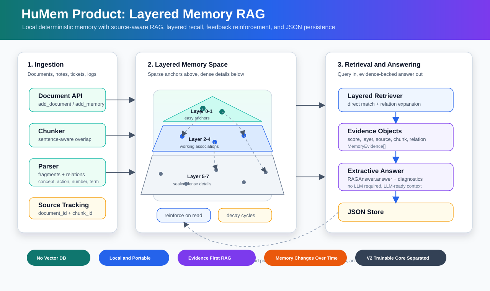

# HuMem Product

## EventRAG v4 主线

HuMem Product 现在新增 `EventRAG` 作为事件中心记忆主线。旧的
`LayeredMemoryRAG` 仍保留为 legacy baseline 和 v3 迁移来源，但新的记忆
思路已经从“碎片分层 + 任意 3D 坐标”改为：

- LLM 将输入抽取为事件 chunk；
- 每个事件保存 `main_label`、输入创建时间 `captured_at`、有序结构化子标签和 `compressed_trace`；
- 子标签覆盖 `when/who/action/object/place/state/cause/outcome/intent` 等角色；
- embedding 只写入主标签和子标签 `embedding_text`，不再默认 embedding 完整原文；
- 检索时先由 LLM 生成关键问题、多个检索词、目标槽位/角色和召回精度，再做关键词与向量混合召回；
- 遗忘不是删除，而是基于 wall-clock Ebbinghaus 难度提高召回门槛；
- v4 viewer 的竖直轴是时间，水平平面是 embedding 语义二维投影。

快速示例：

```python
from humem_product import EventRAG

rag = EventRAG(
    llm_provider="openai-compatible",
    llm_model="your-chat-model",
    embedding_provider="openai",
)

rag.remember(
    "我上个月本来打算申请一笔消费贷买电脑，但是因为实习 offer 还没确定，所以暂时没申请。"
    "现在 offer 已经下来了，我想重新看看额度。"
)

answer = rag.answer("我之前为什么没申请贷款？")
print(answer.answer)
```

CLI v4：

```powershell
humem-product remember "..." --store memory-v4.json --llm-model your-chat-model --embedding-provider openai
humem-product ask "我之前为什么没申请贷款？" --store memory-v4.json --llm-model your-chat-model --embedding-provider openai
humem-product migrate-v4 --from memory-store.json --to memory-v4.json --llm-model your-chat-model --embedding-provider openai
```

SQLite v4 store 可以持久化 HNSW 索引。索引对象是 `embedding_items`
（主标签和子标签），并会按 role 建子索引来保留 `from_where/to_where`
这类方向性：

```powershell
humem-product index --store memory-v4.db --semantic-index ann
humem-product ask "我从哪里出发？" --store memory-v4.db --semantic-index ann --llm-model your-chat-model --embedding-provider openai
```

SQLite v4 stores now include database-core operations around EventRAG:

```powershell
humem-product collection create --store memory-v4.db finance --schema-json "{\"allowed_roles\":[\"when\",\"who\",\"cause\",\"action\",\"state\",\"intent\"],\"required_roles\":[]}"
humem-product remember "..." --store memory-v4.db --collection finance --llm-model your-chat-model --embedding-provider openai
humem-product ask "..." --store memory-v4.db --collection finance --filter-json "{\"where\":{\"metadata.user_id\":{\"eq\":\"u1\"}}}" --llm-model your-chat-model --embedding-provider openai
humem-product delete --store memory-v4.db --event-id <event_id>
humem-product compact --store memory-v4.db --purge-deleted
humem-product backup --store memory-v4.db --to memory-v4.backup.db
```

These operations keep HNSW as a rebuildable candidate index: new memories are
added incrementally, deletes are tombstoned immediately, and `compact` rebuilds
a clean graph.

## EventRAG 逻辑和算法

EventRAG 的核心目标不是把所有历史对话原文塞回上下文，而是把对话压缩成
可检索、可解释、可随时间改变召回难度的事件记忆。它把每次输入拆成一个或
多个事件，每个事件包含：

- `main_label`: 事件主标签，例如“申请消费贷款买电脑”；
- `captured_at`: 记忆写入时的 UTC 时间；
- `subtags`: 有角色和先后顺序的结构化子标签，例如 `when`、`who`、
  `cause`、`action`、`state`、`from_where`、`to_where`、`with_who`；
- `compressed_trace`: 第三层压缩痕迹，用更短文本保留事件整体语义；
- `source`: 原文证据，只用于审计和 debug，默认不进入回答上下文。

写入流程：

```text
raw input
  -> LLM event extraction
  -> MemoryEvent(main_label, captured_at, subtags, compressed_trace)
  -> embed(main_label + subtag.embedding_text)
  -> store events/subtags/embedding_items/source_records
  -> update HNSW indexes if they already exist
```

注意 embedding 的对象是 `main_label` 和 `subtag.embedding_text`，不是完整原文。
这样做的意义是把向量空间建在“结构化记忆线索”上，而不是把整段自然语言混成
一个不可解释的向量。方向性也不交给 embedding 猜，而是由 role 保真：
`from_where=北京` 和 `to_where=北京` 可以拥有相似语义向量，但检索和重排时
它们是不同角色。

查询流程：

```text
user question
  -> LLM RetrievalPlan(key_question, retrieval_terms, target_slots, target_roles, recall_precision)
  -> collection/filter prefilter
  -> keyword match on main_label/subtags
  -> role-aware HNSW or exact vector candidate recall
  -> structured rerank(role, position, keyword, embedding, recall_difficulty)
  -> LLM answer from structured evidence only
```

例如用户问“我之前为什么没申请贷款？”，LLM planner 会生成“贷款、申请贷款、
消费贷款、offer 没确定”等检索词，并把 `target_slots` / `target_roles` 偏向 `cause/action/state`。
系统先召回“申请消费贷款买电脑”事件，再利用子标签的 role 和 position 得到：
`position=1` 的 `cause=offer 还没确定` 与 `action=暂时没申请贷款` 属于同一阶段，
所以答案可以还原为“因为 offer 还没确定”。

`target_slots` 用来处理同一个 role 多次出现的场景，例如同一事件里可能同时有
`place@1=北京`、`place@2=上海`、`place@3=云杉酒店`。HNSW 仍按 role 召回
候选，position 只在最终 rerank 和 evidence 分组里使用，避免把索引复杂化。

召回分数由几部分共同决定：

```text
score =
  keyword_score * 0.46
  + embedding_score * 0.44
  + exactness * 0.10
  + slot_or_role_bonus
```

同时每个事件都有基于 wall-clock 的召回难度：

```text
age_days = now - captured_at
stability = 1
  + reinforcements * 0.32
  + log1p(retrievals) * 0.22
  + positive_feedback * 0.45
  - negative_feedback * 0.12
retention = exp(-forgetting_rate * age_days / stability)
recall_difficulty = 1 - retention
```

这不是删除旧记忆，而是提高旧记忆的命中门槛。久远且没有被强化的事件需要
更精确的检索词才能越过阈值；经常被召回或被正反馈强化的旧事件会保持较低
召回难度。

HNSW 的定位是候选召回层，不是最终判断层。SQLite v4 会持久化 global index 和
role index，例如：

```text
global
role:cause
role:from_where
role:to_where
collection:finance:global
collection:finance:role:cause
```

当新增记忆时，已有 HNSW 图会增量插入新的 `embedding_items`；删除事件时先写
tombstone，让查询立即过滤掉旧节点；`compact` 会物理清理 deleted events 并重建
干净的 ANN 图。JSON store 保持轻量，不保存大型 ANN 图。

SQLite 数据库内核提供 collection、schema、filter DSL、soft delete、replace、
compact 和 backup。filter DSL 是 AND-only，适合在进入 ANN 之前做稳定预过滤：

```json
{
  "collections": ["finance"],
  "roles": ["cause", "state"],
  "where": {
    "event.captured_at": {"gte": "2026-01-01T00:00:00+00:00"},
    "metadata.user_id": {"eq": "u1"}
  },
  "recall": {"max_difficulty": 0.8}
}
```

可视化也跟随这个模型：竖直轴表示 `captured_at`，新记忆在上、旧记忆在下；
水平平面来自事件主标签和子标签 embedding 的二维投影；颜色和透明度表达
`recall_difficulty`。因此视觉上的三维空间不再是假设性的“记忆位置”，而是
“时间轴 + 语义平面”的可解释投影。

HuMem Product 是一个可直接嵌入应用的本地分层记忆 RAG 模块。它从 HuMem 研究原型中拆出稳定的产品层，保留“上层稀疏锚点、下层稠密细节、关系牵引召回、读取强化、遗忘下沉”的记忆机制，同时把 embedding 做成可选增强。

默认模式下，它不需要向量数据库、不需要模型 API、不需要 PyTorch；启用 OpenAI embedding 后，它会变成混合检索：`HuMem 分层记忆分数 + embedding 语义相似度`。

它适合做：

- AI 应用的长期记忆层；
- 个人知识库、客服工单、项目日志的轻量 RAG；
- 不想一开始就部署向量数据库的本地检索与证据层；
- 需要“记忆会随使用变化”的 Agent memory；
- 后续接入 LLM 前的可解释上下文召回模块。

## 架构图



## 两种运行模式

| 模式 | 是否需要 API Key | 适合场景 | 检索方式 |
| --- | --- | --- | --- |
| Local memory mode | 否 | 本地、离线、零成本、可解释记忆 | 分层规则检索 + 关系扩展 |
| Hybrid embedding mode | 是，默认 `OPENAI_API_KEY` | 查询改写、同义表达、语义相似召回 | HuMem 分层分数 + embedding 相似度 |

默认就是 Local memory mode。只有显式传入 `embedding_provider="openai"` 或 CLI 传 `--embedding-provider openai` 时，才会调用 OpenAI Embeddings API。

## 核心能力

| 能力 | 说明 |
| --- | --- |
| 文档写入 | `add_document()` 会切分文本、解析记忆片段、建立来源映射 |
| 记忆写入 | `add_memory()` 适合写入短事实、用户偏好、会话摘要 |
| Chunking | 默认 `chunk_size=700`、`chunk_overlap=80`，可在写入时调整 |
| 分层记忆 | 上层保存易召回锚点，下层保存噪声更高但可能有用的细节 |
| 关系扩展 | 被 sealed 的底层细节不会轻易直接命中，但可以被上层锚点通过关系带出 |
| 可选 embedding | 默认模型为 `text-embedding-3-small`，embedding 保存在 JSON store 的 chunk 中 |
| 混合检索 | 默认权重 `memory_weight=0.65`、`embedding_weight=0.35` |
| 检索策略剖面 | 内置 `balanced`、`conservative`、`semantic`、`exploratory`、`archival`，便于对照实验 |
| 证据对象 | 查询返回 `MemoryEvidence`，包含来源、层级、分数、关系路径和 chunk |
| 抽取式答案 | `answer()` 会基于最佳证据组装一个可直接返回或交给 LLM 的上下文答案 |
| 读取强化 | 每次 retrieve/answer 会温和强化被命中的片段 |
| 显式反馈 | `apply_feedback()` 可强化有用证据、抑制无用证据，并把反馈写入记忆状态 |
| 遗忘衰减 | `decay()` 默认使用 cycle-based Ebbinghaus retention curve，让弱激活片段以非线性方式下沉 |
| 记忆整合 | `consolidate()` 会把反复出现或高价值片段压缩成上层主题锚点，并保留证据关系 |
| 本地持久化 | 支持 JSON store 和 SQLite store，保存完整记忆图、文档、chunk、embedding、布局、计数器和 RAG 策略配置 |

## 安装

从仓库根目录安装：

```bash
pip install -e .
```

安装后会得到命令行工具：

```bash
humem-product --help
```

如果不安装，也可以从仓库根目录临时运行：

```powershell
$env:PYTHONPATH = "src"
python -m humem_product.cli --help
```

## API Key 放在哪里？

如果不启用 embedding，不需要任何 API Key。

如果启用 OpenAI embedding，推荐把 key 放到环境变量：

```powershell
$env:OPENAI_API_KEY = "你的 OpenAI API Key"
```

Linux/macOS：

```bash
export OPENAI_API_KEY="your-openai-api-key"
```

代码中也可以直接传入，但不建议把 key 写进仓库：

```python
rag = LayeredMemoryRAG(
    embedding_provider="openai",
    embedding_api_key="your-openai-api-key",
)
```

## 快速开始：本地模式

```python
from humem_product import LayeredMemoryRAG

rag = LayeredMemoryRAG()

rag.add_document(
    "Alice keeps the robot launch checklist in the blue notebook. "
    "The temporary launch code 45123789 appeared once on the receipt.",
    document_id="launch-notes",
    title="Launch Notes",
)

answer = rag.answer("robot launch checklist", limit=5)

print(answer.answer)
for item in answer.evidence:
    print(item.title, item.layer, item.score, item.text)

rag.save("memory-store.json")
```

## 检索策略和反馈闭环

默认策略是 `balanced`。如果你在做研发对照，可以显式选择不同 profile：

```python
from humem_product import LayeredMemoryRAG

rag = LayeredMemoryRAG(retrieval_profile="semantic")
```

内置策略：

| Profile | 用途 |
| --- | --- |
| `balanced` | 默认行为，分层记忆和 embedding 均衡 |
| `conservative` | 更信任上层锚点和规则召回，适合高精度场景 |
| `semantic` | 提高 embedding 相似度权重，适合查询改写和同义表达 |
| `exploratory` | 更宽松地探索关联，读取强化更温和 |
| `archival` | 只读检索，不因查询而强化记忆，适合评测和审计 |

反馈会直接改变记忆状态：

```python
answer = rag.answer("incident response runbook")
bad_id = answer.evidence[0].fragment_id

rag.apply_feedback(
    query="incident response runbook",
    negative_fragment_ids=[bad_id],
    reason="user_rejected_evidence",
)
```

正反馈会强化片段；负反馈会降低片段的 activation / strength / ease，并按 profile 配置把它推向更深层。反馈元数据会保存在 fragment metadata 中，JSON 和 SQLite store 都会持久化这些变化。

当记忆积累到一定规模后，可以运行一次确定性的“整合周期”：

```python
result = rag.consolidate(
    scope="document",
    max_anchors=8,
    keywords_per_anchor=5,
    min_support=3,
)
```

整合会扫描高激活、高强度、被检索、被正反馈或多来源支持的片段，生成上层 `Consolidated memory` anchor，并用 `consolidates` 关系连接到底层证据。这个过程不调用 LLM，适合作为稳定基线；后续可以把候选生成替换成 embedding 聚类或模型摘要。

## 快速开始：启用 OpenAI embedding

```python
from humem_product import LayeredMemoryRAG

rag = LayeredMemoryRAG(
    embedding_provider="openai",
    embedding_model="text-embedding-3-small",
    memory_weight=0.65,
    embedding_weight=0.35,
)

rag.add_document(
    "Alice keeps the robot launch checklist in the blue notebook.",
    title="Launch Notes",
)

# 字面没有 checklist/launch，也能通过 embedding 语义召回
answer = rag.answer("Where is the robotics deployment plan stored?")
print(answer.answer)

rag.save("memory-store.json")
```

如果已有 store 是之前本地模式写入的，可以加载后补 embedding：

```python
rag = LayeredMemoryRAG.load_with_embeddings(
    "memory-store.json",
    embedding_provider="openai",
)

embedded_count = rag.embed_missing_chunks()
rag.save("memory-store.json")
```

## Chunk 和 embedding 细节

Chunking 在 `src/humem_product/rag.py` 的 `_chunk_text()` 中实现：

```python
rag.add_document(
    text,
    chunk_size=700,
    chunk_overlap=80,
)
```

默认策略：

- 先按句子/换行切分；
- 尽量把句子合并到不超过 `chunk_size`；
- 相邻 chunk 保留 `chunk_overlap` 字符的上下文；
- 每个 chunk 会保存 `document_id`、`chunk_id`、`title`；
- 启用 embedding 时，每个 chunk 会保存 `embedding` 和 `embedding_model`。

Embedding provider 在 `src/humem_product/embeddings.py` 中实现。当前内置：

- `OpenAIEmbeddingProvider`
- 默认模型：`text-embedding-3-small`
- 接口：`POST https://api.openai.com/v1/embeddings`
- 不依赖 OpenAI SDK，使用 Python 标准库发请求

OpenAI 官方 Embeddings API 参考见：

- https://platform.openai.com/docs/api-reference/embeddings/create
- https://platform.openai.com/docs/guides/embeddings

## Semantic Navigation Index

HuMem now has an optional runtime semantic navigation layer for embedded
chunks. This is where KANN/HNSW-like graph search belongs in the project: it
helps find candidate `SourceChunk.embedding` neighbors, but it does not replace
the HuMem memory graph and does not create durable `relations`.

Configuration:

```python
rag = LayeredMemoryRAG(
    embedding_provider="openai",
    semantic_index="auto",  # "auto" | "exact" | "ann"
)
```

- `exact` keeps the original full cosine scan and is the correctness baseline.
- `auto` uses exact scan for small stores, then lazily builds the ANN graph once
  enough embedded chunks exist.
- `ann` forces the runtime navigation graph for experiments and benchmarks.

The navigation graph is a rebuildable cache: JSON and SQLite stores keep chunk
embeddings and the lightweight policy, but not the graph edges. Final ranking
still flows through HuMem's existing memory weight, embedding weight,
accessibility, relation bonus, and evidence merge.

## 命令行使用

本地模式写入文档：

```bash
humem-product ingest notes.txt --store memory-store.json --title "Launch Notes"
```

启用 OpenAI embedding 写入文档：

```bash
humem-product ingest notes.txt \
  --store memory-store.json \
  --title "Launch Notes" \
  --embedding-provider openai \
  --embedding-model text-embedding-3-small
```

查询：

```bash
humem-product ask "robot launch checklist" --store memory-store.json
```

用指定 profile 查询：

```bash
humem-product ask "robotics deployment plan" \
  --store memory-store.json \
  --retrieval-profile semantic
```

启用 embedding 查询。若已有 chunk 没有 embedding，会自动补齐并保存：

```bash
humem-product ask "robotics deployment plan" \
  --store memory-store.json \
  --embedding-provider openai
```

如果不想自动补齐旧 chunk：

```bash
humem-product ask "robotics deployment plan" \
  --store memory-store.json \
  --embedding-provider openai \
  --no-auto-embed
```

选择语义导航策略：

```bash
humem-product ask "robotics deployment plan" \
  --store memory-store.json \
  --embedding-provider openai \
  --semantic-index auto
```

`humem-product stats --store memory-store.json` 会输出当前 semantic index
policy、embedded chunk 数量、索引是否已构建、最近一次检索策略和访问候选数。

返回 JSON，适合服务端或脚本集成：

```bash
humem-product ask "robot launch checklist" --store memory-store.json --json
```

把用户或评测反馈写回记忆状态：

```bash
humem-product feedback \
  --store memory-store.json \
  --query "robot launch checklist" \
  --positive "<fragment-id>" \
  --negative "<fragment-id>" \
  --reason "reviewed_by_user" \
  --json
```

查看状态：

```bash
humem-product stats --store memory-store.json
```

执行记忆整合：

```bash
humem-product consolidate \
  --store memory-store.json \
  --scope document \
  --max-anchors 8 \
  --min-support 3 \
  --json
```

执行遗忘衰减：

```bash
humem-product decay --store memory-store.json --cycles 3 --step 0.14
```

### SQLite 产品化存储

JSON store 适合演示、测试和导出；本地产品化使用可以改用 SQLite：

```powershell
humem-product migrate --from memory-store.json --to memory.db
humem-product stats --store memory.db
humem-product ask "robot launch checklist" --store memory.db
humem-product visualize --store memory.db
```

CLI 会按后缀自动选择存储：`.json` 使用 JSON，`.db` / `.sqlite` / `.sqlite3` 使用 SQLite。SQLite 第一版仍然完整加载到内存后事务写回，但数据已经拆成 `documents`、`chunks`、`fragments`、`relations`、`events` 等表，后续可以继续升级为增量写入和服务端 API。

## 产品接口

### `LayeredMemoryRAG.add_document`

```python
doc_id = rag.add_document(
    text,
    document_id="optional-stable-id",
    title="Human Readable Title",
    metadata={"source": "crm"},
    chunk_size=700,
    chunk_overlap=80,
    cool_down_cycles=1,
)
```

适合写入长文本。模块会生成 `SourceDocument`、`SourceChunk`，并把每个记忆片段和来源 chunk 绑定。

### `LayeredMemoryRAG.add_memory`

```python
fragment_ids = rag.add_memory(
    "User prefers concise technical explanations.",
    source="profile",
    metadata={"user_id": "u_123"},
)
```

适合写入短期或长期事实，例如用户偏好、会话摘要、任务状态。

### `LayeredMemoryRAG.retrieve`

```python
evidence = rag.retrieve("incident response runbook", limit=8)
```

返回 `MemoryEvidence`：

| 字段 | 含义 |
| --- | --- |
| `fragment_id` | 记忆片段 ID |
| `text` | 命中的片段文本 |
| `kind` | `clause`、`concept`、`action`、`number`、`term` 等 |
| `layer` | 当前所在记忆层，数字越小越容易召回 |
| `score` | 混合后的最终分数 |
| `memory_score` | HuMem 分层记忆原始分数 |
| `embedding_score` | embedding cosine similarity |
| `via_relation` | 关系扩展类型；embedding 命中会标记为 `embedding` |
| `document_id` | 来源文档 |
| `chunk_id` | 来源 chunk |
| `title` | 来源标题 |
| `chunk_text` | 可交给 LLM 的完整 chunk 文本 |

### `LayeredMemoryRAG.answer`

```python
answer = rag.answer("incident response runbook", limit=6)
```

`answer()` 不调用 LLM。它返回的是抽取式答案和证据。你可以直接展示，也可以把 `answer.evidence` 拼进自己的 LLM prompt。

### `LayeredMemoryRAG.apply_feedback`

```python
result = rag.apply_feedback(
    query="incident response runbook",
    positive_fragment_ids=["fragment-id-a"],
    negative_fragment_ids=["fragment-id-b"],
    reason="human_review",
)
```

返回 `FeedbackResult`，包含已应用的 positive / negative fragment id、被忽略的 id，以及当前 profile、反馈强度和层级直方图。正反馈调用强化机制；负反馈会抑制并下沉片段。

### `LayeredMemoryRAG.consolidate`

```python
result = rag.consolidate(
    scope="document",
    max_anchors=8,
    keywords_per_anchor=5,
    min_support=3,
)
```

返回 `MemoryConsolidationResult`，包含新建或刷新的 anchor id、候选主题、支撑关系数量和诊断信息。`scope` 可以是 `document`、`chunk` 或 `global`。默认算法是确定性的：按 activation、strength、retrievals、source_count、层级可访问性和反馈信号为片段打分，再生成上层主题锚点。

### `LayeredMemoryRAG.embed_missing_chunks`

```python
count = rag.embed_missing_chunks(batch_size=32)
```

当你给旧 store 开启 embedding 时，用这个方法补齐缺失的 chunk embedding。

### `LayeredMemoryRAG.decay`

```python
rag.decay(cycles=3, step=0.14)
```

遗忘衰减会降低激活和强度，让弱记忆逐渐下沉。这个机制用于把“长期不用的细节”推向较深层，而不是让所有内容永远同等容易被召回。

默认遗忘模型是 cycle-based Ebbinghaus 曲线：`forgettings` 作为经过的
cycles，`step` 会缩放遗忘速率。`strength`、`retrievals`、正反馈、重复来源和
关系支撑会提高 stability，让有价值的记忆忘得更慢；负反馈会提高遗忘速率；
`consolidate()` 生成的上层 anchor 会轻微衰减但不会被普通遗忘快速推到底层。

如需回到旧版线性衰减，可显式配置：

```python
rag = LayeredMemoryRAG(
    dynamics={"forgetting_model": "linear"},
)
```

### `LayeredMemoryRAG.save/load`

```python
rag.save("memory-store.json")
rag = LayeredMemoryRAG.load("memory-store.json")
```

如果要加载并启用 embedding：

```python
rag = LayeredMemoryRAG.load_with_embeddings(
    "memory-store.json",
    embedding_provider="openai",
)
```

JSON / SQLite store 保存：

- RAG config（retrieval profile、memory / embedding weight）；
- memory space 配置；
- fragments；
- relations；
- source documents；
- chunks；
- optional chunk embeddings；
- activation / strength / retrieval counters；
- relation cross-layer 状态；
- SQLite store 还会保存轻量事件日志，例如 ingest、retrieve、feedback、decay、layout、migrate。

## 后端集成示例

```python
from humem_product import LayeredMemoryRAG

STORE_PATH = "memory-store.json"

try:
    rag = LayeredMemoryRAG.load_with_embeddings(
        STORE_PATH,
        embedding_provider="openai",
    )
except FileNotFoundError:
    rag = LayeredMemoryRAG(
        embedding_provider="openai",
    )


def ingest_note(user_id: str, text: str) -> str:
    doc_id = rag.add_document(
        text,
        title=f"user:{user_id}",
        metadata={"user_id": user_id},
    )
    rag.save(STORE_PATH)
    return doc_id


def answer_question(query: str) -> dict:
    result = rag.answer(query)
    rag.save(STORE_PATH)
    return {
        "answer": result.answer,
        "evidence": [
            {
                "text": item.text,
                "title": item.title,
                "layer": item.layer,
                "score": item.score,
                "memory_score": item.memory_score,
                "embedding_score": item.embedding_score,
                "chunk": item.chunk_text,
            }
            for item in result.evidence
        ],
        "diagnostics": result.diagnostics,
    }
```

## 和普通 RAG 的区别

普通 RAG 往往把所有 chunk 放进同一个向量索引里，默认每条记忆有类似的可召回机会。HuMem Product 使用分层记忆图：

- 高频、核心、重复出现的内容更容易上浮；
- 一次性数字、临时编号、低显著细节更容易下沉；
- 下层 sealed 内容不会轻易直接命中，减少噪声；
- 但如果它和上层锚点有关，仍然能通过关系扩展进入证据；
- 查询本身会改变记忆状态，让常用内容更容易被再次召回；
- 启用 embedding 后，语义相似召回会补上规则检索的短板。

这让它更像一个“会变化的长期记忆层”，而不只是静态检索器。

## 项目结构

```text
humem-product/
  src/humem_product/
    __init__.py
    cli.py             # command-line interface
    embeddings.py      # optional OpenAI embedding provider
    memory_space.py    # layered memory graph runtime
    models.py          # dataclasses
    navigation.py      # runtime semantic navigation index for embedded chunks
    parser.py          # lightweight parser and relation extraction
    consolidation.py   # deterministic anchor creation from recurring memories
    policy.py          # retrieval profiles and feedback defaults
    rag.py             # product-facing RAG API
    visualization.py   # local 3D memory graph viewer server
    viewer/            # bundled browser UI and Three.js assets
  docs/
    assets/
      layered-memory-rag.svg
    decisions/
      0001-*.md        # architecture/product decision records
    product-module.md
  tests/
    test_layered_rag.py
  pyproject.toml
  README.md
```

## 测试

```bash
python -m unittest discover -s tests
```

当前测试覆盖：

- 文档写入和来源追踪；
- answer/evidence 返回；
- JSON save/load 和 SQLite round-trip；
- sealed 底层细节通过上层锚点关系召回；
- fake embedding provider 的语义召回；
- 旧 store 补齐缺失 embedding；
- retrieval profile 持久化和 `archival` 只读检索；
- positive / negative feedback 对记忆状态的影响；
- Ebbinghaus / linear 两种遗忘模型，以及强化、负反馈、anchor 对 retention 的影响；
- consolidation anchor 创建、刷新和支撑关系；
- semantic navigation exact/auto/ann 策略、ANN lazy build、失效重建和 JSON/SQLite round-trip；
- CLI ingest / ask / feedback / consolidate / layout 的 SQLite 工作流。

## 决策记录

本轮研发改动的设计取舍记录在 `docs/decisions/`。新增或改变运行时行为、持久化格式、CLI 能力、评测范围时，都应同步补一条 decision record，避免以后只看代码猜意图。

## 本地评测和可视化

仓库内置一个零依赖评测脚本，会生成 SVG 图和 Markdown 报告：

```bash
python scripts/evaluate_memory_system.py --output reports
```

输出文件：

```text
reports/
  memory_system_report.md
  memory_system_metrics.json
  forgetting_curve.svg
  recall_reinforcement.svg
  linked_recall.svg
```

这组评测会检查：

- 一次性数字记忆是否随 `decay()` 衰减并下沉；
- Ebbinghaus retention 是否让强化记忆比普通记忆保持更高激活比例；
- 重复查询是否强化目标记忆并提升原始召回分数；
- sealed 底层细节是否能通过上层锚点关系被带出；
- negative feedback 是否削弱并下沉被抑制的记忆；
- consolidation 是否能创建上层 anchor 并连接多个支撑片段。
- semantic navigation 是否在 exact 与 ANN top-k 之间保持可观测 overlap，并报告访问候选数和耗时。

### 3D 交互式记忆图

如果已经有 JSON 或 SQLite store，可以直接启动本地 3D 可视化界面：

```powershell
python -m humem_product.cli visualize --store memory-store.json
```

默认会在本机启动服务并打开浏览器：

```text
http://127.0.0.1:8765/
```

可视化界面会读取 store 中的 `fragments`、`relations`、`layer/x/y/z`、`depth`、`activation`、`strength`、`accessibility` 和来源信息，把每个记忆片段显示为 3D 节点，把关系显示为突触连线。节点的连续高度来自 `depth`，半透明记忆层膜仍对应离散 layer；节点大小表达强度，亮度表达激活度；点击节点可以查看正文、activation 环、来源 chunk、一阶关联记忆和当前可访问性。

新版 viewer 更偏仿生记忆空间：

- 上层/深层以半透明 lamina 呈现，帮助观察“可召回表层”和“下沉痕迹”；
- 关系以 relation-colored synapse 呈现，并带有流动脉冲；
- consolidation anchor 使用独立几何体和光环，不再混在普通节点里；
- 顶部 vitals 展示 activation、strength、access、anchor 数；
- 左下 `Recall Field` 展示 upper recall、deep trace、anchor density、mean access；
- `O / A / D` 三个视图模式分别聚焦整体、anchor、深层痕迹；
- 右侧详情面板展示 memory state、activation ring、consolidation terms、source/chunk 和 synaptic neighbors。

如果 store 已运行 `consolidate`，可视化顶部会显示 anchor 数量；anchor 节点详情会展示 consolidation scope 和主题词。

如果想把当前 store 的节点坐标写回为连续记忆空间布局，可以先运行：

```powershell
python -m humem_product.cli layout --store memory-store.json
```

`layout` 默认使用 `--embedding-scope chunk`，只复用 store 里已有的 chunk embedding 和显式关系，不会自动调用外部服务；没有 embedding 时会退化为 relation/hash force layout。可选 scope：

```text
chunk     复用来源 chunk embedding，适合低成本语义布局
fragment 复用或生成 fragment text embedding，布局更细但成本更高
none      只用显式关系和哈希初始位置
```

若需要补齐 chunk embedding，可以显式传入 embedding provider 和 `--embed-missing`：

```powershell
python -m humem_product.cli layout --store memory-store.json --embedding-provider openai --embedding-scope chunk --embed-missing
```

若要生成并缓存 fragment-level embedding：

```powershell
python -m humem_product.cli layout --store memory-store.json --embedding-provider openai --embedding-scope fragment --embed-missing
```

检索时，关键词分数和 embedding 分数会乘以 `accessibility`。上层记忆权重更高，下层记忆权重更低，但下层记忆仍然可以通过高相似度或上层关联锚点被召回；`ask --json` 会输出 `raw_keyword_score`、`raw_embedding_score`、`relation_bonus`、`accessibility` 和 `final_score` 等诊断字段。

常用操作：

- 鼠标拖拽旋转视角；
- 鼠标滚轮平滑缩放；
- `Shift + 滚轮` 横向平移；
- `Ctrl + 滚轮` 上下平移；
- 搜索框可以定位包含关键词的记忆；
- 左下角可以按层级显示或隐藏节点。

如果还没有 store，可以先导入一段文本：

```powershell
python -m humem_product.cli ingest notes.txt --store memory-store.json --title "Demo Notes"
python -m humem_product.cli visualize --store memory-store.json
```

也可以指定 host、port，或只启动服务不自动打开浏览器：

```powershell
python -m humem_product.cli visualize --store memory-store.json --host 127.0.0.1 --port 8765 --no-open
```

## License

MIT
