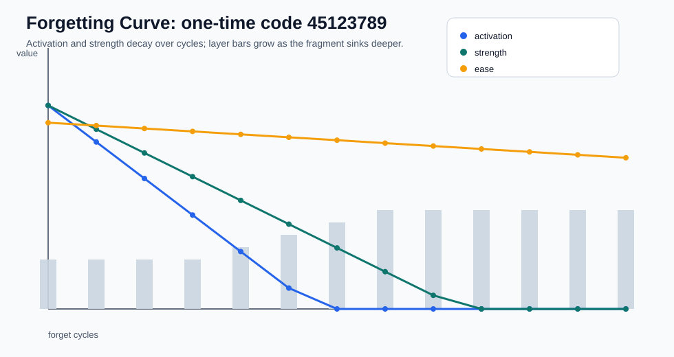
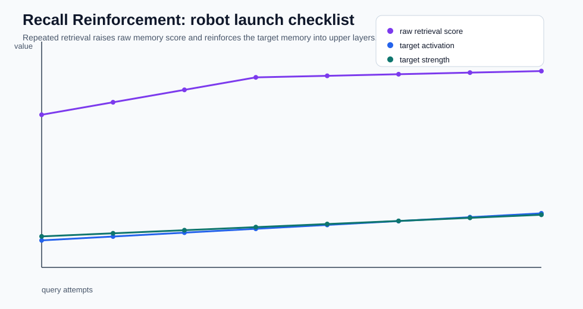
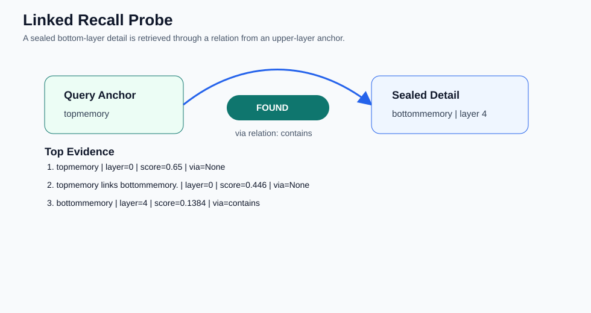

# HuMem Product Local Evaluation Report

Generated by `scripts/evaluate_memory_system.py`.

## Visuals

## Summary

| Probe | Result |
| --- | --- |
| Forgetting activation | 0.780 -> 0.000 |
| Forgetting strength | 0.780 -> 0.000 |
| Forgetting layer | 3 -> 7 |
| Recall top score | 3.161 -> 4.065 |
| Recall target activation | 0.560 -> 1.120 |
| Recall target strength | 0.642 -> 1.090 |
| Linked bottom detail found | True |
| Linked recall relation | contains |

## How To Read This

- The forgetting curve should trend downward for activation/strength while the layer moves deeper.
- The recall reinforcement curve should trend upward or stay high as repeated reads strengthen useful memory.
- The linked recall probe should show a bottom-layer detail surfacing through a relation, proving sealed details are not simply lost.
