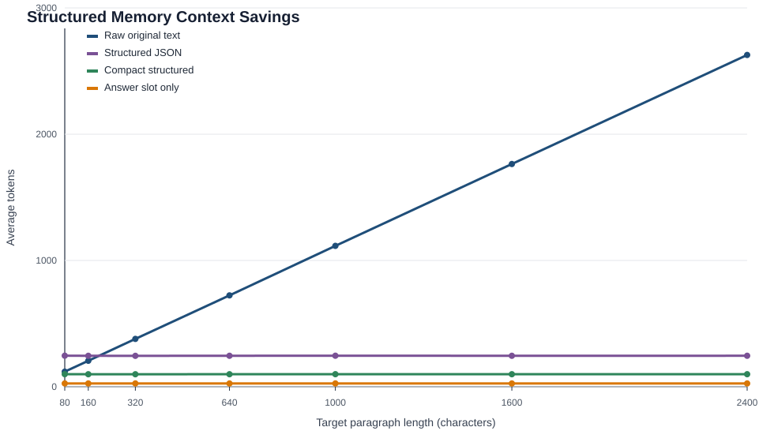

# Structured Context Savings Evaluation

- Samples: 2000
- Seed: 20260511
- Tokenizer: `tiktoken:cl100k_base`
- Chart: 

## Overall

| Context | Avg Tokens | Avg Savings vs Raw |
| --- | ---: | ---: |
| Raw original text | 989.55 | - |
| Structured JSON | 245.42 | 32.95% |
| Compact structured | 99.33 | 72.87% |
| Answer slot only | 26.12 | 92.85% |

## By Paragraph Length

| Target Chars | Raw | Structured JSON | Compact | Answer Slot | Compact Savings |
| ---: | ---: | ---: | ---: | ---: | ---: |
| 80 | 119.52 | 246.03 | 99.70 | 26.26 | 16.65% |
| 160 | 205.80 | 245.16 | 99.06 | 26.13 | 51.83% |
| 320 | 378.95 | 244.85 | 99.06 | 26.23 | 73.85% |
| 640 | 723.60 | 245.35 | 99.27 | 25.98 | 86.26% |
| 1000 | 1115.76 | 245.77 | 99.60 | 26.23 | 91.06% |
| 1600 | 1764.08 | 245.30 | 99.23 | 25.90 | 94.37% |
| 2400 | 2627.58 | 245.46 | 99.39 | 26.14 | 96.21% |

## Notes

- Raw context includes the user query plus the whole paragraph.
- Structured JSON includes main label, compressed trace, and role/position/value subtags.
- Compact structured is closer to the minimal evidence format a prompt would feed to the answer model.
- Answer slot only is an optimistic lower bound after retrieval and reranking already selected the exact slot.